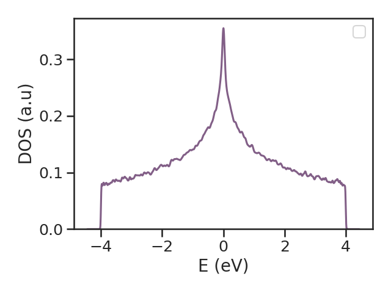

The [`#!python kite.Calculation`][calculation] object carries the information about the to be calculated quantities, the *target functions*.
For this, parameters related to the Chebyshev expansion are included here.
The parameters are used by [KITEx] to determine the coefficients that are used by [KITE-tools][kitetools]
to calculate the required target functions.
The parameters given in the [Examples] already have optimized parameters for a standard desktop computer.

The target function currently available are:

* [`#!python dos`][calculation-dos]
  : Calculate the global density of states (DoS) as a function of energy.
* [`#!python ldos`][calculation-ldos]
  : Calculate the local density of states (LDoS) as a function of
  energy [for a set of lattice positions].
* [`#!python arpes`][calculation-arpes]
  : Calculate the ARPES response.
* [`#!python gaussian_wave_packet`][calculation-gaussian_wave_packet]
  : Calculate the propagation of a gaussian wave-packet.
* [`#!python conductivity_dc`][calculation-conductivity_dc]
  : Calculate the DC conductivity.
* [`#!python conductivity_optical`][calculation-conductivity_optical]
  : Calculate the linear optical conductivity as a function of frequency.
* [`#!python conductivity_optical_nonlinear`][calculation-conductivity_optical_nonlinear]
  : Calculate the 2nd-order nonlinear optical conductivity.
* [`#!python singleshot_conductivity_dc`][calculation-singleshot_conductivity_dc]
  : Calculate the longitudinal DC conductivity for a set of Fermi
  energies [uses the $\propto\mathcal{O}(N)$ single-shot method].

    !!! Info "Processing the output of `#!python singleshot_conductivity_dc()`"

        [`#!python singleshot_conductivity_dc()`][calculation-singleshot_conductivity_dc]
        works different from the other target-functions in that a
        single run with [KITEx][kitex] is sufficient. The results don't have to be processed by
        [KITE-tools][kitetools].
        As such, the results are already available in the [HDF5]-file. You can extract the results from the
        [HDF5]-file [as explained in the tutorial][tutorial-hdf5], with `#!python "output.h5"` the name of the
        [HDF5]-file processed by [KITEx][kitex]:
                  
        ``` python linenums="1"
        import numpy as np
        from h5py import File
        condDC = File("output.h5", "r+")['Calculation']['singleshot_conductivity_dc']['SingleShot']
        np.savetxt("condDC.dat",condDC)                
        ``` 

All target functions require the following parameters:

* `#!python num_moments`
  : defines the number of moments of the Chebyshev expansion and hence the energy resolution of the calculation; see [Documentation][documentation].
* `#!python num_random`
  : Defines the number of random vectors for the stochastic evaluation
  of traces.
* `#!python num_disorder`
  : Defines the number of disorder realisations
  [and boundary twists if the "random" boundary mode is chosen].

Some parameters are specific for the target function:

* `#!python direction`
  : Specifies the component of the linear
  [longitudinal: `#!python 'xx'`, `#!python 'yy'` (, `#!python 'zz'`), transversal: `#!python 'xy'`, `#!python 'yx'` (, `#!python 'xz'`, `#!python 'yz'`)] or the nonlinear conductivity tensor [e.g., `#!python 'xyx'` or `#!python 'xxz'`] to be calculated.
* `#!python temperature`
  : Temperature of the Fermi-Dirac distribution used to evaluate
    optical and DC conductivities. If $eV$ is used as a unit of `#!python energy`, then `#!python
    temperature` is measured in Kelvin. [Internally, the `#!python temperature` is converted to $eV$ through Boltzmann's constant $k_B$.
    To define the `#!python temperature` in arbitrary units, specify the quantity $k_B T$, which has units of energy.]
* `#!python num_points`
  : Number of energy points used by the post-processing tool to output the density of states.
* `#!python special`
  : Simplified form of nonlinear optical conductivity hBN example.
* `#!python energy`
  : Selected value of energy at which we want to calculate the `#!python singleshot_conductivity_dc`
* `#!python eta`
  : Imaginary energy component used in the Green function's. This
    provides a controlled broadening or phenomelogical energy-scale
    for inelastic processes. For technical details, see [Documentation][documentation].

The `#!python calculation` is structured in the following way:

``` py linenums="1"
calculation = kite.Calculation(configuration)
calculation.dos(
    num_points=1000,
    num_random=10,
    num_disorder=1,
    num_moments=512
)
calculation.conductivity_optical(
    num_points=1000,
    num_random=1,
    num_disorder=1,
    num_moments=512,
    direction='xx'
)
calculation.conductivity_dc(
    num_points=1000,
    num_moments=256,
    num_random=1,
    num_disorder=1,
    direction='xy',
    temperature=1
)
calculation.singleshot_conductivity_dc(
    energy=[(n / 100.0 - 0.5) * 2 for n in range(101)],
    num_moments=256,
    num_random=1,
    num_disorder=1,
    direction='xx',
    eta=0.02
)
calculation.conductivity_optical_nonlinear(
    num_points=1000,
    num_moments=256,
    num_random=1,
    num_disorder=1,
    direction='xx',
    temperature=1.0,
    special=1
)
```

!!! note

    The user can decide what functions are used in a calculation.
    However, it is not possible to configure the same function twice in the same Python script (HDF5 file).

When these objects are defined, we can export the file that will contain set of input instructions for [KITEx][kitex]
using the [`#!python kite.config_system`][config_system] function: function:
``` python
kite.config_system(lattice, configuration, calculation, filename='test.h5')
```

### Running the code

To [run the code][kitex] and to [post-process][kitetools] it, run from the `#!bash kite/`-directory

``` bash
./build/KITEx test.h5
./tools/build/KITE-tools test.h5
```

!!! Info "KITE-tools output"

    The [output][kitetools-output] of [KITE-tools][kitetools] is dependent of the target function.
    Each spicific case is described in the [API][kitetools-output].
    The [output][kitetools-output] is generally a `#!python "*.dat"`-file where the various columns of data contain
    the required target functions.


## Visualizing the data

After calculating the quantity of interest and post-processing the data, we can plot the resulting data with the following script:

``` py linenums="1"
data=np.loadtxt('dos.dat')

plt.plot(data[:,0], data[:,1])
plt.xlabel('E (eV)')
plt.ylabel('DOS (a.u)')
```
<div>
  <figure>
    
    <figcaption> </figcaption>
  </figure>
</div>

If you want to make these steps more automatic, you can use the following Bash script:

``` bash linenums="1"
#!/bin/bash

file_out=example1                 # name of python script that exports the HDF5-file
file_in=example1                  # name of the exported HDF5-file

python ${file_out}.py             # make a model
./KITEx ${file_in}.h5             # run Kite

./tools/KITE-tools ${file_in}.h5  # run the post-processing steps
python plot_dos.py                # display the data
```


[HDF5]: https://www.hdfgroup.org
[pybinding]: https://docs.pybinding.site/en/stable
[lattice]: https://docs.pybinding.site/en/stable/_api/pybinding.Lattice.html
[documentation]: ../background/index.md
[tightbinding]: ../background/tight_binding.md

[lattice-tutorial]: tb_model.md
[tutorial-hdf5]: editing_hdf_files.md

[kitepython]: ../api/kite.md
[kitex]: ../api/kitex.md
[kitetools]: ../api/kite-tools.md
[kitetools-output]: ../api/kite-tools.md#output

[calculation]: index.md
[DOS]: index.md
[conductivity]: index.md
[modifications]: index.md
[disorder]: index.md
[Examples]: examples/graphene.md

[configuration]: ../api/kite.md#configuration
[configuration-divisions]: ../api/kite.md#configuration-divisions
[configuration-length]: ../api/kite.md#configuration-length
[configuration-boundaries]: ../api/kite.md#configuration-boundaries
[configuration-is_complex]: ../api/kite.md#configuration-is_complex
[configuration-precision]: ../api/kite.md#configuration-precision
[configuration-spectrum_range]: ../api/kite.md#configuration-spectrum_range
[configuration-angles]: ../api/kite.md#configuration-angles
[configuration-custom_local]: ../api/kite.md#configuration-custom_local
[configuration-custom_local_print]: ../api/kite.md#configuration-custom_local_print
[calculation]: ../api/kite.md#calculation
[calculation-dos]: ../api/kite.md#calculation-dos
[calculation-ldos]: ../api/kite.md#calculation-ldos
[calculation-arpes]: ../api/kite.md#calculation-arpes
[calculation-gaussian_wave_packet]: ../api/kite.md#calculation-gaussian_wave_packet
[calculation-conductivity_dc]: ../api/kite.md#calculation-conductivity_dc
[calculation-conductivity_optical]: ../api/kite.md#calculation-conductivity_optical
[calculation-conductivity_optical_nonlinear]: ../api/kite.md#calculation-conductivity_optical_nonlinear
[calculation-singleshot_conductivity_dc]: ../api/kite.md#calculation-singleshot_conductivity_dc

[config_system]: ../api/kite.md#config_system
