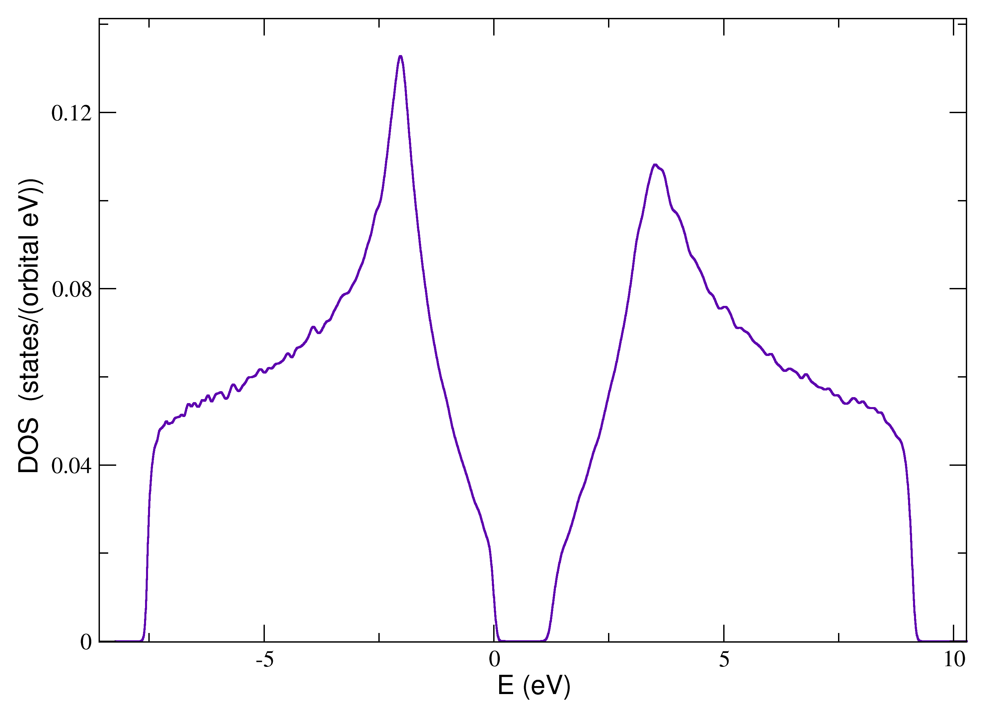
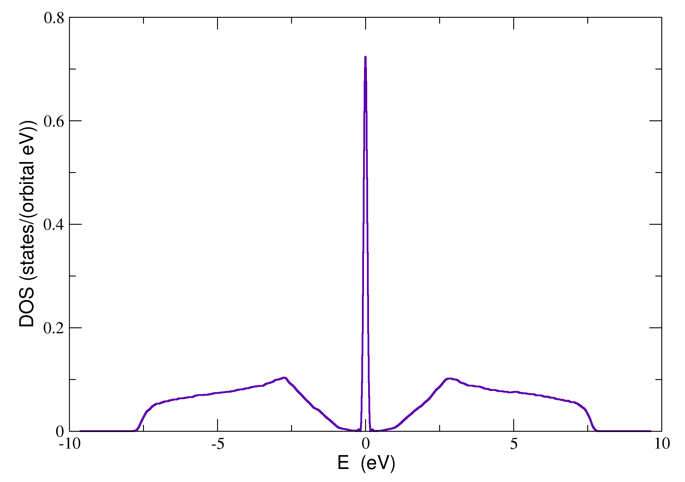

KITE's disorder implementation — general-purpose and user-friendly — is one of its main features.
The inclusion of disorder in a given system follows a simple recipe:
users select a default disorder (e.g., uncorrelated on-site potential and random vacancy defects) or define their own bespoke _disorder patterns_ in the [Python interface][kite-script] to simulate a specific disorder landscape.
This information is passed on to [KITEx] and used to automatically perform the required modifications of on-site energies and hopping terms across the whole lattice _on-the-fly_.

!!! Info
    Disorder patterns are local modifications of the Hamiltonian that can be constricted to one unit cell or can connect neighboring unit cells.


KITE handles both standard uncorrelated disorder (e.g., random on-site energies) and realistic
short-range disorder (e.g., vacancies or impurity scattering centers distributed randomly over the
lattice sites with a specified concentration). KITE can handle multiple disorder patterns simultaneously.

_Disorder implementation_: After defining a [regular lattice][tutorial-lattice], disorder can be added to the system.
KITE allows the user to select between on-site and structural disorder by choosing between predefined classes
in the [python interface][kite-script].
The interface provides two different classes of disorder:

* [`#!python kite.Disorder`][disorder] - onsite disorder with two possible statistical distributions
* [`#!python kite.StructuralDisorder`][structural_disorder] - multi-orbital impurities and defects (including bond disorder) with a given concentration

## Onsite disorder

[`#!python kite.Disorder`][disorder] adds randomly generated on-site terms at the sites of a desired sublattice drawn from one of the two statistical distributions:

* Gaussian
* Uniform

One can select a sublattice type in which the disorder will appear, the mean
value and the standard deviation of the selected distribution.
To include on-site disorder, one builds the [`#!python pb.lattice`][lattice] and
use the following procedure:

``` python
# define an object based on the lattice
disorder = kite.Disorder(lattice)
# add Gaussian distributed disorder at all sites of a selected sublattice
disorder.add_disorder('A', 'Gaussian', mean, std)
```

In a single object it is possible to select multiple sublattices, each with its own disorder distribution
following the rule [`#!python kite.Disorder.add_disorder('sublattice', 'type', mean, std)`][disorder-add_disorder]. For example,

``` python
disorder.add_disorder('A', 'Gaussian', 0.1, 0.1)
disorder.add_disorder('B', 'Uniform', 0.2, 0.1)
```

The final step consists of adding the disorder as an additional parameter into the
[`#!python kite.config_system`][config_system] function:

``` python
kite.config_system(..., disorder=disorder)
```

A complete example that calculates the average density of states of graphene with different on-site disorder
distributions on each sublattice is given below:

``` python linenums="1"
""" Onsite disorder
    Lattice : Monolayer graphene (from Pybinding repository);
    Disorder : Uncorrelated on-site disorder (uniform PDF) on single sublattice;
    Configuration : size of the system 1024×1024, with domain decomposition (nx=ny=2),
                    periodic boundary conditions,
                    double precision, automatic scaling;
    Calculation : DOS;
    Modification : magnetic field is off;
"""

import kite
import numpy as np
from pybinding.repository import graphene

# load graphene lattice from Pybinding repository 
lattice = graphene.monolayer(nearest_neighbors=1,onsite=(0,0),t=-2.7)

# add Disorder
disorder = kite.Disorder(lattice)
mean = 1.5 # mean
std  = 1.0 # standard deviation
disorder.add_disorder('A', 'Uniform', mean, std)

# Manual rescaling: lower/upper bounds on smallest/largest energy eigenvalue
t = -2.7
Emax = 3*np.abs(t) + mean + np.sqrt(3)*std
Emin = -3*np.abs(t) + mean - np.sqrt(3)*std

# Calculation settings
nx = ny = 2    #number of decomposition parts
lx = ly = 1024 #number of unit cells in each direction
# Boundary Mode
mode = "periodic"
configuration = kite.Configuration(
    divisions=[nx, ny],
    length=[lx, ly],
    boundaries=[mode, mode],
    is_complex=False,
    precision=1,
    spectrum_range=[Emin,Emax])
    
# require the calculation of DOS
calculation = kite.Calculation(configuration)
calculation.dos(num_points=5000, num_moments=512, num_random=1, num_disorder=1)
# configure the *.h5 file
kite.config_system(lattice, configuration, calculation, filename='on_site_disorder.h5', disorder=disorder)
``` 
<div>
  <figure>
    
    <figcaption>DOS for the on-site disorder example.</figcaption>
  </figure>
</div>


## Structural disorder

[`#!python kite.StructuralDisorder`][structural_disorder] class adds the possibility of selecting between two different
short-range disorder types, i.e. vacancy defects, randomly distributed with a certain concentration over lattice sites on a selected sublattice,
and a more generic multi-orbital disorder which may combine of on-site and hopping terms 
(also distributed with a certain concentration).

### Example 1: Vacancy defects

To add vacancy defects with a given
[`#!python concentration`][structuraldisorder-concentration] on a single sublattice one uses the simple instruction:

``` python
struc_disorder = kite.StructuralDisorder(lattice, concentration=0.2)
struc_disorder.add_vacancy('B') # add a vacancy to a selected sublattice
```

!!! note
    To distribute the vacancies on both sublattices (compensated or otherwise), one needs to treat each sublattice as a separate
    object of the class [`#!python kite.StructuralDisorder`][structural_disorder]
    
   

    ``` python
    struc_disorder_A = kite.StructuralDisorder(lattice, concentration=0.1)
    struc_disorder_A.add_vacancy('A')
    struc_disorder_B = kite.StructuralDisorder(lattice, concentration=0.1)
    struc_disorder_B.add_vacancy('B')
    disorder_structural = [struc_disorder_A, struc_disorder_B]
    ```

### Example 2: mixed on-site/bond disorder


The following example illustrates KITE's most general type of short-range disorder, which includes both atomic defects (vacancies)
and bond modifications.
This type of disorder can be added as an object of the class [`#!python kite.StructuralDisorder`][structural_disorder].
The procedure is analogous to adding a hopping term to the
[Pybinding lattice object][lattice].

For the sake of clarity, let us first define sublattices that will compose the disorder.
In this case we are not restricted to a single unit cell:

``` python
#  define a node in a unit cell [i, j] selecting a single sublattice
node0 = [[+0, +0], 'A']
node1 = [[+0, +0], 'B']
node2 = [[+1, +0], 'A']
node3 = [[+0, +1], 'B']
node4 = [[+0, +1], 'A']
node5 = [[-1, +1], 'B']
```

After the definition of a parent [`#!python kite.StructuralDisorder`][structural_disorder] object, we can define the desired pattern:

``` python
 # define an object based on the lattice with a certain concentration
struc_disorder = kite.StructuralDisorder(lattice, concentration=0.2)

struc_disorder.add_structural_disorder(
    # add bond disorder in the form
    #  [from unit cell], 'sublattice_from', [to_unit_cell], 'sublattice_to', value:
    (*node0, *node1, 0.5),
    (*node1, *node2, 0.1),
    (*node2, *node3, 0.5),
    (*node3, *node4, 0.3),
    (*node4, *node5, 0.4),
    (*node5, *node0, 0.8),
    # in this way we can add onsite disorder in the form [unit cell], 'sublattice', value
    ([+0, +0], 'B', 0.1)
)

# It is possible to add multiple different disorder types which
#  should be forwarded to the config_system function as a list.
another_struc_disorder = kite.StructuralDisorder(lattice, concentration=0.6)
another_struc_disorder.add_structural_disorder(
    (*node0, *node1, 0.05),
    (*node4, *node5, 0.4),
    (*node5, *node0, 0.02),
    ([+0, +0], 'A', 0.3)
)
```

Before exporting the settings to the [HDF5]-file, it is possible to define multiple disorder realizations which will be
superimposed to the clean system.

The following script has a minimal example of how to configure the structural disorder

``` python linenums="1"
""" Mixed short-range disorder
    Lattice : Monolayer graphene (from Pybinding repository);
    Disorder : StructuralDisorder class - bond and vacancy disorder;
    Configuration : size of the system 1024x1024, with domain decomposition (nx=ny=2),
                    periodic boundary conditions,
                    double precision, manual scaling;
    Calculation : DOS;
    Modification : magnetic field is off;
"""

import kite
import numpy as np
from pybinding.repository import graphene

#load graphene lattice from Pybinding repository
lattice = graphene.monolayer(nearest_neighbors=1,onsite=(0,0),t=-2.7)

# Add short-range mixed disorder as an object of a class StructuralDisorder.
# In this manner we can add onsite and bond defects with a specific concentration.

node0 = [[+0, +0], 'A']
node1 = [[+0, +0], 'B']
node2 = [[+1, +0], 'A']
node3 = [[+0, +1], 'B']
node4 = [[+0, +1], 'A']
node5 = [[-1, +1], 'B']

struc_disorder_one = kite.StructuralDisorder(lattice, concentration=0.05)
struc_disorder_one.add_structural_disorder(

# add bond disorder in the form
# [from unit cell], 'sublattice_from', [to_unit_cell], 'sublattice_to', value:
(*node0, *node1, 1),
(*node1, *node2, 1),
(*node2, *node3, 1),
(*node3, *node4, 1),
(*node4, *node5, 1),
(*node5, *node0, 1),
# in this way we can add onsite disorder in the form [unit cell], 'sublattice', value
([+0, +0], 'B', 0.3))

# It is possible to add multiple different disorder type which
# should be forwarded to the export_lattice function as a list.

struc_disorder_two = kite.StructuralDisorder(lattice, concentration=0.2)
struc_disorder_two.add_structural_disorder(
    (*node0, *node1, 0.4),
    (*node4, *node5, 0.4),
    (*node5, *node0, 0.4),
    ([+0, +0], 'B', 0.4))

struc_disorder_two.add_vacancy('B')

struc_disorder_three = kite.StructuralDisorder(lattice, concentration=0.01)
struc_disorder_three.add_vacancy('A')

# if there is disorder it should be returned separately from the lattice
disorder_structural = [struc_disorder_one, struc_disorder_two, struc_disorder_three]

# Manual rescaling: lower/upper bounds on smallest/largest energy eigenvalue

t = -2.7
Emax = 3*np.abs(t)*1.2 
Emin = -3*np.abs(t)*1.2

#Calculation settings

nx = ny = 2     #number of decomposition parts
lx = ly = 1024  #number of decomposition parts 

#Boundary mode
mode = "periodic"
configuration = kite.Configuration(
    divisions=[nx, ny],
    length=[lx, ly],
    boundaries=[mode, mode],
    is_complex=False,
    precision=1,
    spectrum_range=[Emin,Emax])

# require the calculation of DOS
calculation = kite.Calculation(configuration)
calculation.dos(num_points=5000, num_moments=512, num_random=1, num_disorder=1)

# configure the *.h5 file
kite.config_system(lattice, configuration, calculation, filename='mixed_disorder.h5',
                   disorder_structural=disorder_structural)
```

with the resulting density of states:

<div>
  <figure>
    
    <figcaption>DOS for the structural disorder example.</figcaption>
  </figure>
</div>

[HDF5]: https://www.hdfgroup.org
[Pybinding]: https://docs.pybinding.site/en/stable
[lattice]: https://docs.pybinding.site/en/stable/_api/pybinding.Lattice.html
[tutorial-lattice]: tb_model.md
[comment]: <> (Class StructuralDisorder)
[structural_disorder]: ../api/kite.md#structuraldisorder
[comment]: <> (Class Parameters)
[structuraldisorder-lattice]: ../api/kite.md#structuraldisorder-lattice
[structuraldisorder-concentration]: ../api/kite.md#structuraldisorder-concentration
[structuraldisorder-position]: ../api/kite.md#structuraldisorder-position
[comment]: <> (Class Methods)
[structuraldisorder-add_vacancy]: ../api/kite.md#structuraldisorder-add_vacancy
[structuraldisorder-add_structural_disorder]: ../api/kite.md#structuraldisorder-add_structural_disorder
[structuraldisorder-add_local_vacancy_disorder]: ../api/kite.md#structuraldisorder-add_local_vacancy_disorder
[structuraldisorder-add_local_bond_disorder]: ../api/kite.md#structuraldisorder-add_local_bond_disorder
[structuraldisorder-add_local_onsite_disorder]: ../api/kite.md#structuraldisorder-add_local_onsite_disorder
[structuraldisorder-map_the_orbital]: ../api/kite.md#structuraldisorder-map_the_orbital

[kite-script]: ../api/kite.md
[KITEx]: ../api/kitex.md

[comment]: <> (Class Disorder)
[disorder]: ../api/kite.md#disorder
[comment]: <> (Class Parameters)
[disorder-lattice]: ../api/kite.md#disorder-lattice
[comment]: <> (Class Methods)
[disorder-add_disorder]: ../api/kite.md#disorder-add_disorder
[disorder-add_local_disorder]: ../api/kite.md#disorder-add_local_disorder
[config_system]: ../api/kite.md#config_system

[comment]: <> (Class Configuration)
[configuration]:  ../api/kite.md#configuration
[comment]: <> (Class Parameters)
[configuration-divisions]:  ../api/kite.md#configuration-divisions
[configuration-length]:  ../api/kite.md#configuration-length
[configuration-boundaries]:  ../api/kite.md#configuration-boundaries
[configuration-is_complex]:  ../api/kite.md#configuration-is_complex
[configuration-precision]:  ../api/kite.md#configuration-precision
[configuration-spectrum_range]:  ../api/kite.md#configuration-spectrum_range
[configuration-angles]:  ../api/kite.md#configuration-angles
[configuration-custom_local]:  ../api/kite.md#configuration-custom_local
[configuration-custom_local_print]:  ../api/kite.md#configuration-custom_local_print
[comment]: <> (Class Attributes)
[configuration-energy_scale]:  ../api/kite.md#configuration-energy_scale
[configuration-energy_shift]:  ../api/kite.md#configuration-energy_shift
[configuration-comp]:  ../api/kite.md#configuration-comp
[configuration-prec]:  ../api/kite.md#configuration-prec
[configuration-div]:  ../api/kite.md#configuration-div
[configuration-bound]:  ../api/kite.md#configuration-bound
[configuration-leng]:  ../api/kite.md#configuration-leng
[configuration-type]:  ../api/kite.md#configuration-type
[configuration-custom_pot]:  ../api/kite.md#configuration-custom_pot
[configuration-print_custom_pot]:  ../api/kite.md#configuration-print_custom_pot
[comment]: <> (Class Methods)
[configuration-set_type]:  ../api/kite.md#configuration-set_type
