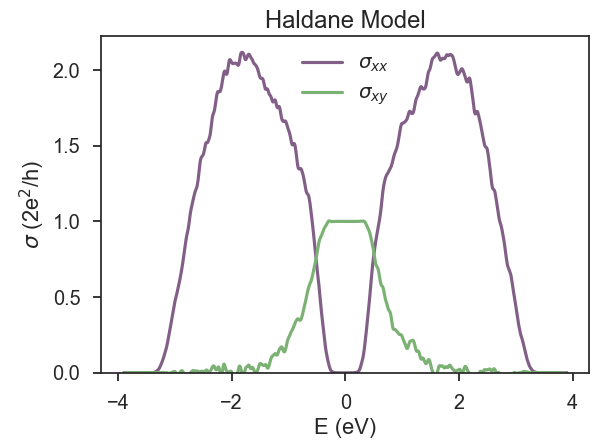
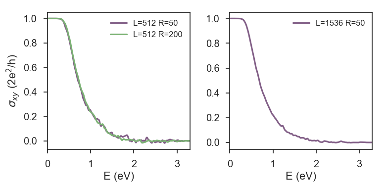

## The Haldane model

The Haldane Hamiltonian is a single-orbital tight-binding model on a honeycomb lattice with a sublattice-staggered
on-site potential (orbital mass) and complex hoppings between next-nearest-neighbor sites that produce a staggered
magnetic field configuration with vanishing total flux through the unit cell [^1].

This model is a Chern insulator, or a quantum anomalous Hall insulator because it hosts integer quantum Hall effect
in the absence of an external magnetic field.

This characteristic makes Haldane model ideal for illustrating another capability of KITE: the calculation of transverse conductivities.

### Lattice
Let us begin with the definition of the Hamiltonian for the case of pure imaginary next-nearest-neighbor hoppings:

``` python linenums="1"
def haldane(onsite=(0, 0), t=1):
    """Return lattice specification for Haldane model"""

    # parameters
    a = 0.24595  # [nm] unit cell length
    a_cc = 0.142  # [nm] carbon-carbon distance
    t2 = t/10

    # define lattice vectors
    a1 = a * np.array([a, 0])
    a2 = a * np.array([1 / 2, 1 / 2 * np.sqrt(3)])

    # create a lattice with 2 primitive vectors
    lat = pb.Lattice(a1=a1, a2=a2)

    # add sublattices
    lat.add_sublattices(
        # name, position, and onsite potential
        ('A', [0, -a_cc/2], onsite[0]),
        ('B', [0,  a_cc/2], onsite[1])
    )

    # Add hoppings
    lat.add_hoppings(
        # inside the main cell, between which atoms, and the value
        ([0,  0], 'A', 'B', -t),
        # between neighboring cells, between which atoms, and the value
        ([1, -1], 'A', 'B', -t),
        ([0, -1], 'A', 'B', -t),
        ([1, 0], 'A', 'A', -t2 * 1j),
        ([0, -1], 'A', 'A', -t2 * 1j),
        ([-1, 1], 'A', 'A', -t2 * 1j),
        ([1, 0], 'B', 'B', -t2 * -1j),
        ([0, -1], 'B', 'B', -t2 * -1j),
        ([-1, 1], 'B', 'B', -t2 * -1j)
    )
    return lat
```

## KITE part
### Settings
In the following section explain the steps to calculate the Hall coductivity.
After defining `#!python kite.configuration`, as explained in [Getting Started documentation][getting_started], we can set `#!python kite.calculation`.
The post-processing tool uses the energy bounds from the density of state to perform the integration in energy.
It is better to couple conductivity with DOS:

``` python
calculation.dos(num_points=1000,
                num_moments=512,
                num_random=10,
                num_disorder=1)
calculation.conductivity_dc(num_points=1000,
                            num_moments=256,
                            num_random=50,
                            num_disorder=1,
                            direction='xy',
                            temperature=100)
```

### Disorder
We can include [different types of disorder][disorder].
For simplicity, we consider onsite uniform disorder distribution with width of `#!python 0.4 eV` and zero average onsite energy (Anderson disorder):

``` python
disorder = kite.Disorder(lattice)
disorder.add_disorder('A', 'Uniform', +0.0, 0.4)
disorder.add_disorder('B', 'Uniform', +0.0, 0.4)
```

### Calculation
This is a full spectral calculation where KITEx calculates the coefficients of the Chebyshev expansion and KITE-tools
uses that moments to calculate the transverse conductivity.
Both `#!python temperature` and `#!python num_points` are parameters used by KITE-tools and it is possible to modif
them without running KITEx again.
This type of calculation typically requires more RAM memory than DOS or single-shot DC conductivity,
which imposes limitations to the sizes of the systems (that still can reach large scales with available memory).
The relative errors of the stochastic trace evaluation (STE) scales with the inverse of the system size,
which means that full spectrum conductivities typically require more random vectors to decrease the relative error of the STE.
The relative error of the STE also depends on the Hamiltonian and the calculated quantities.
Transverse conductivities have more fluctuations, at least in part of the spectrum outside the topological gap, and this tutorial illustrates this issue.

Fig. 1 shows the longitudinal and transverse conductivity for a small lattice of Haldane model in a calculation that took 3 minutes on a laptop.
KITEx captures the anomalous quantum Hall plateau extremely well, with a relative error of less than 0.1%.
But it is also clear that the transverse conductivity presents significantly more fluctuations outside the plateau than the longitudinal conductivity, and we already considered 50 random vectors.

This figure can be reproduced using KITE-tools while specifying some additional parameters as explained in example 4 of [Post-processing tools documentation](../postprocessing.md):

``` bash
./KITE-tools haldane.h5 --CondDC -F -4 4 1000
```

Which calculates the DC conductivity for 1000 equidistant Fermi energies in the range `#!python [-4, 4]`.
The result can be plotted by using the minimal python script below.
This script can be easily modified to plot both the longitudinal and transverse conductivity on one figure. 

### Visualisation
``` python
import numpy as np
import matplotlib.pyplot as plt

data = np.loadtxt('condDC.dat')
plt.plot(data[:,0], data[:,1])
plt.show()
```

<div>
  <figure>
    
    <figcaption> </figcaption>
  </figure>
</div>

We now focus on strategies to decrease the fluctuations.
Depending on the computational resources, one possibility is increasing the system size.
It is also possible to increase the number of random vectors.
This is illustrated in Fig. 2.

<div>
  <figure>
    
    <figcaption> </figcaption>
  </figure>
</div>

Finally, there are other physical ways of damping them: temperature and disorder.
The use of these last two resources depend on the goals of the numerical calculation.
In the present case, where we wanted to see the quantum anomalous Hall plateau, we can simply consider Anderson disorder and work with intermediate temperatures.


!!! example

    Get more familiar with KITE: tweak the [full script for this calculation][repository_example]
    and play with variations of system size, number of random vectors, disorder and temperature.

[^1]: F. D. M. Haldane, [Phys. Rev. Lett. **61**, 2015 (1988)](https://journals.aps.org/prl/abstract/10.1103/PhysRevLett.61.2015).

[^2]: J. H. García, L. Covaci, and T. G. Rappoport, [Phys. Rev. Lett. **114**, 116602 (2015)](https://doi.org/10.1103/PhysRevLett.114.116602) (Supplementary material)

[disorder]: ../disorder.md
[repository_example]: https://github.com/quantum-kite/kite/tree/master/examples/dos_dccond_haldane.py
[getting_started]: ../index.md