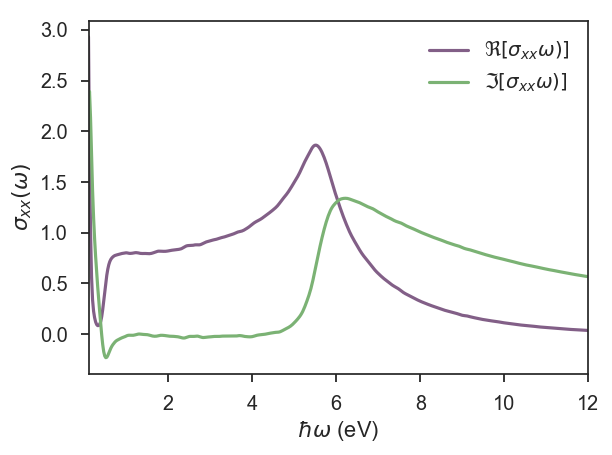
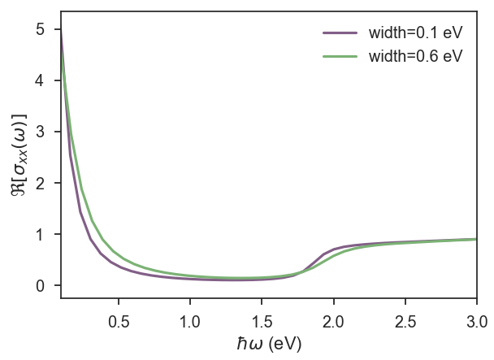

## Gaussian disorder
KITE can also calculate the optical conductivity of a given tight-binding model for any desired chemical potential/temperature.
To illustrate this capability, here we calculate the optical conductivity of disordered graphene, that can be compared qualitatively with previous results[^1]. 
_The full script can be found [here](https://github.com/quantum-kite/kite/blob/313a00e54a9f9aa33b22886eaf97ce62aaec3996/examples/dos_optcond_graphene.py)._

### Lattice
Instead of manually defining the lattice, we can use of one the pre-defined lattices from Pybinding:

```python
    from pybinding.repository import graphene
    lattice = graphene.monolayer()
```

## KITEx part
### Disorder
To illustrate a different type of disorder, we add random on-site energies that follow a Gaussian distribution:

```python 
    disorder = kite.Disorder(lattice)
    disorder.add_disorder('B', 'Gaussian', 0.0, 1.5)
    disorder.add_disorder('A', 'Gaussian', 0.0, 1.5)
```

where we define the type of statistical distribution, the sublattices where they are located, the mean value of the distribution and its width (in eV here).

### Settings and calculation
After configuring the system, as presented in the [Getting Started](../index.md) tutorial, it is time to set up the calculation:

```python 
    calculation = kite.Calculation(configuration)
    calculation.conductivity_optical(num_points=1000, num_disorder=1,
                     num_random=20, num_moments=512, direction='xx')
```

The transverse optical conductivity (`xy`,`xz`, etc.) can also be calculated, which can be quite interesting in systems that also present transverse responses (e.g. due to a nontrivial band topology) [^3].
However, in this example we focus exclusively on the longitudinal optical conductivity.
The other quantities that can be set in the Python script are the same as for the calculation of the density of states: number of energy points used in KITE-tools, Chebyshev moments in the expansions, random vectors and disorder realizations.

Export the KITE model and run [KITEx][kitex] as before.

## Post-processing and visualization

The post-processing step is similar to that of other examples (see [post-processing tools documentation](../postprocessing.md)). For example, you may run

``` bash
./build/KITE-tools name_of_IO_file_here.h5 --CondOpt -F 2.5 -T 0.025 -S 0.01 -O 0.1 12 250
```

which outputs the complex optical conductivity in a uniform grid with $250$ points covering the frequency range `[0.1:12]` eV for a Fermi energy of `2.5` eV and a temperature of  `25` meV. The requested energy resolution is set to `10` meV.

### Visualization
The results of the real and imaginary parts of the optical conductivity presented in the Fig. 1 were obtained on a standard laptop with calculations that took 8 minutes for a system with `N=512 x 512` units cells  and a total of `512 x 512` expansion moments (`#!python num_moments=512`).


<div>
  <figure>
    
    <figcaption>Figure 1: Frequency dependence of graphene's complex optical conductivity. </figcaption>
  </figure>
</div>


For systems sizes of `N=1536 x 1536` unit cells and two different Gaussian widths, we show $\Re [\sigma_{xx}(\omega)]$ for low frequencies (see Fig. 2). In both figures, one can clearly see the Drude's peak for $\omega\rightarrow 0$ and the onset of interband transitions at $\hbar \omega>2 E_F$ [^2].


<div>
  <figure>
    
    <figcaption>Figure 1: Real part of the optical conductivity over a narrower frequency range for two choices of disorder strength as indicated.</figcaption>
  </figure>
</div>

The complete Python script for this calculation can be found [here](https://github.com/quantum-kite/kite/blob/65ad6aa84c6c735e4a23d2ffa9a8cb5ba36a70f9/examples/dos_optcond_gaussian_disorder.py).


[^1]: Shengjun Yuan, Rafael Roldán, Hans De Raedt, Mikhail I. Katsnelson, [Phys. Rev. B **84**, 195418 (2011)](https://link.aps.org/doi/10.1103/PhysRevB.84.195418)

[^2]: T. Stauber, N. M. R. Peres, A. K. Geim, [Phys. Rev. B **78**, 085432 (2008)](https://journals.aps.org/prb/abstract/10.1103/PhysRevB.78.085432)

[^3]: S. M. João et al, [R. Soc. open sci. 7, 191809 (2020)](https://royalsocietypublishing.org/doi/full/10.1098/rsos.191809)

[kitex]: ../../api/kitex.md
[kitetools]: ../../api/kite-tools.md