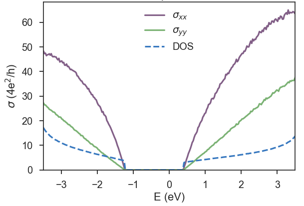

## Phosphorene
This is a small tutorial to illustrate the use of KITE to investigate materials with anisotropic electrical conductivity.
To this end, we consider a simplified tight-binding model for single layer phosphorene [^1].
Even though this model is very simple, it captures the anisotropic band structure of phosphorene, which is Dirac like in one direction and Schrödinger like in the other direction.
This behaviour results in highly anisotropic transport properties [^2].

Here, we calculate the longitudinal conductivity (`singleshot_conductivity_dc`) via the efficient single-shot algorithm [^3] in the vicinity of the band gap.
This is a fast numerical calculation, that is set to run in a normal laptop for about 3-4 minutes.
It can reproduce qualitatively the expected anisotropic conductivity along xx and yy directions.

Here, we highlight parts of the python script.
The full script can be retrieved from [KITE's Github repository](https://github.com/quantum-kite/kite/blob/80a028026956c088f0c8fa4a019155b3b1bdcb78/examples/dccond_phosphorene.py).

### Lattice

After the imports that are necessary for KITE, we define the lattice, with [Pybinding](http://docs.pybinding.site/en/stable/tutorial/lattice.html):

``` python linenums="1"
from numpy import cos, sin, pi

def monolayer_4band(num_hoppings=4):
"""Monolayer phosphorene lattice using the four-band model

Parameters
----------
num_hoppings : int
    Number of hopping terms to consider: from t2 to t5.
"""
a = 0.222  # nm
ax = 0.438  # nm
ay = 0.332  # nm
theta = 96.79 * (pi / 180)
phi = 103.69 * (pi / 180)

lat = pb.Lattice(a1=[ax, 0], a2=[0, ay])

h = a * sin(phi - pi / 2)
s = 0.5 * ax - a * cos(theta / 2)
lat.add_sublattices(('A', [-s/2,        -ay/2, h], 0),
                    ('B', [ s/2,        -ay/2, 0], 0),
                    ('C', [-s/2 + ax/2,     0, 0], 0),
                    ('D', [ s/2 + ax/2,     0, h], 0))

lat.register_hopping_energies({'t1': -1.22, 't2': 3.665, 't3': -0.205,
                               't4': -0.105, 't5': -0.055})

if num_hoppings < 2:
    raise RuntimeError("t1 and t2 must be included")
elif num_hoppings > 5:
    raise RuntimeError("t5 is the last one")

if num_hoppings >= 2:
    lat.add_hoppings(([-1,  0], 'A', 'D', 't1'),
                     ([-1, -1], 'A', 'D', 't1'),
                     ([ 0,  0], 'B', 'C', 't1'),
                     ([ 0, -1], 'B', 'C', 't1'))
    lat.add_hoppings(([ 0,  0], 'A', 'B', 't2'),
                     ([ 0,  0], 'C', 'D', 't2'))
if num_hoppings >= 3:
    lat.add_hoppings(([ 0,  0], 'A', 'D', 't3'),
                     ([ 0, -1], 'A', 'D', 't3'),
                     ([ 1,  1], 'C', 'B', 't3'),
                     ([ 1,  0], 'C', 'B', 't3'))
if num_hoppings >= 4:
    lat.add_hoppings(([ 0,  0], 'A', 'C', 't4'),
                     ([ 0, -1], 'A', 'C', 't4'),
                     ([-1,  0], 'A', 'C', 't4'),
                     ([-1, -1], 'A', 'C', 't4'),
                     ([ 0,  0], 'B', 'D', 't4'),
                     ([ 0, -1], 'B', 'D', 't4'),
                     ([-1,  0], 'B', 'D', 't4'),
                     ([-1, -1], 'B', 'D', 't4'))
if num_hoppings >= 5:
    lat.add_hoppings(([-1,  0], 'A', 'B', 't5'),
                     ([-1,  0], 'C', 'D', 't5'))

lat.min_neighbors = 2
return lat
```

Note that this lattice model, as given above, can be used with different number of hoppings.
The user can decide the number that is used in the calculation when defining the lattice:

``` python
lattice=monolayer_4band(num_hoppings=4)
```

## KITEx part
### Settings
To use the large-scale single-shot algorithm for direct evaluation of zero-temperature DC conductivities, the resolvent operator requires a nonzero broadening (resolution) parameter `eta`, which is given in the specified units (eV in the example above).
As this type of calculation is energy dependent, it is also necessary to provide a list of desired energy points to the calculation object.
In the single shot calculations, the computational time scales linearly with the energy points.
For this example, that is intended to run in a normal desktop, we consider a small number of points and the energy range is set in the vicinity of the band gap.

The number of points and the list of energy points can be created when calling the calculation, as illustrated here:

``` python linenums="1"
calculation = kite.Calculation(configuration)
npoints = 25
epoints = [(1.0 / npoints * i) * 3.5  for i in range(npoints)]
calculation.singleshot_conductivity_dc(epoints,
                                       num_moments=512,
                                       num_random=5,
                                       num_disorder=1,
                                       direction='xx',
                                       eta=0.02)
```

Now it is time to save the configuration in a hdf file:

``` python
    kite.config_system(lattice, configuration, calculation, filename='phxx.h5')
```

Export the KITE model to an HDF file:

``` bash
python3 script_name_here.py
```

### Calculation

Run the [KITEx][kitex] program.

### Visualization
After running KITEx no post-processing is required for the singleshot conductivity calculation. The result can be extracted and plotted with the following script:

``` python linenums="1"
import h5py
import matplotlib.pyplot as plt
import matplotlib as mpl
import seaborn as sns

mpl.rcParams['figure.dpi'] = 100
mpl.rcParams['savefig.dpi'] = 100
sns.set_style("white")
# Kite color scheme
colors = ["dusty purple", "faded green", "windows blue", "amber", "greyish"]
current_palette = sns.xkcd_palette(colors)
sns.set_palette(current_palette)
sns.set_style("ticks")
sns.set_context("talk", font_scale=1.1)

file_name = 'phxx.h5'

num_points = 25
energy = [(1.0 / num_points * i) * 3.5 for i in range(num_points)]

file_input = h5py.File(file_name, 'r+')
single_shot = file_input['Calculation']['singleshot_conductivity_dc']['SingleShot']
cond = single_shot[:, 3]

plt.plot(energy, cond, 'o-')
plt.xlabel('$E$ [eV]')
plt.ylabel(r'$\sigma$ [$4e^2 / h$]')
plt.title('Phosphorene')

plt.tight_layout()
plt.show()
```


It is not possible to request the same type of calculation (target function) in a single call.
In this case, we want to calculate the conductivity in xx and yy directions where the type of the calculation is the same, which means we need another HDF file for yy conductivity.

Let's repeat the procedure for another direction (or alternative use the streamlined approach of the example on the [KITE repository](https://github.com/quantum-kite/kite/blob/80a028026956c088f0c8fa4a019155b3b1bdcb78/examples/dccond_phosphorene.py)):

``` python linenums="1"
    calculation.singleshot_conductivity_dc(epoints,
                                           num_moments=512,
                                           num_random=5,
                                           num_disorder=1,
                                           direction='xx',
                                           eta=0.02)
    kite.config_system(lattice, configuration, calculation, filename='phyy.h5')
```

The result of this fast calculation can be seen in the figure below, for ``lx=ly=512``.
To get a feeling of how KITE works, we suggest modifying parameters like ``eta`` and ``num_random``.


In the next figure, we repeat the calculation for 300 energy points and 10 random vectors and a large energy window.



[^1]: Alexander N. Rudenko, Mikhail I. Katsnelson, [Phys. Rev. B 89, 201408 (2014)](https://journals.aps.org/prb/abstract/10.1103/PhysRevB.89.201408).

[^2]: H. Liu, A. T. Neal, Z. Zhu, X. Xu , D. Tomanek and P. D. Ye, [ACS Nano 8, 4033 (2014)](https://pubs.acs.org/doi/abs/10.1021/nn501226z)

[^3]: A. Ferreira and E. R. Mucciolo, [Phys. Rev. Lett. 115, 106601 (2015)](https://journals.aps.org/prl/abstract/10.1103/PhysRevLett.115.106601).

[tutorial]: ../index.md
[calculation]: ../../api/kite.md#calculation
[getting_started]: ../index.md
[lattice]: https://docs.pybinding.site/en/stable/_api/pybinding.Lattice.html
[kitex]: ../../api/kitex.md
[kitetools]: ../../api/kite-tools.md