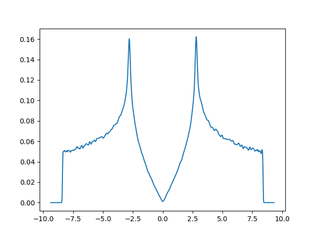

This tutorial covers the basic aspects that are necessary to start using KITE.
You will learn about the different steps in KITE's workflow and how to tweak the different parameters.

The tutorial is structured as follows:

1. Learning KITE's workflow
2. Building a tight-binding model using [`#!python pb.Lattice`][lattice]
3. How to define the settings for KITE simulations
4. How to calculate the different target functions 
5. Post-processing the results with [*KITE-tools*][kitetools]
6. Adding disorder or magnetic field to the tight-binding model
7. How to edit the [HDF5]-file
8. Optimizing the settings for various calculations

!!! Example "First calculation with KITE"
    
    Let us do a simple first calculation with KITE.
    *(Do not worry about the details just now, these will be covered later in the tutorial.)*

    !!! Tip
    
        Run this example from the `#!bash kite/`-folder to have acces to [KITE's python package][kitepython].

    ``` python linenums="1"
    import kite
    import numpy as np
    import matplotlib.pyplot as plt 
    from pybinding.repository import graphene
    from os import system as terminal

    conf = kite.Configuration(divisions=[4, 4], length=[512, 512], boundaries=["periodic", "periodic"])
    calc = kite.Calculation(conf)
    calc.dos(num_points=4000, num_moments=512, num_random=2, num_disorder=1)
    kite.config_system(graphene.monolayer(), conf, calc, filename="first_calculation.h5")

    terminal("build/KITEx first_calculation.h5")
    terminal("tools/build/KITE-tools first_calculation.h5")

    dos = np.loadtxt("dos.dat")
    plt.plot(dos[:, 0], dos[:, 1])
    plt.xlabel("Energy (eV)")
    plt.ylabel("Density of States (a.u)")
    plt.show()
    ```
  
    <div>
      <figure>
        
        <figcaption>The result from your first KITE calculation: the density of states of monolayer graphene.</figcaption>
      </figure>
    </div>


!!! Info "Examples" and "More Examples"
    
    Section [Examples] contains step-by-step examples aimed to expand on key concepts covered by the Tutorial.
    Additional resources are available in the section [More examples][examples-folder].


[HDF5]: https://www.hdfgroup.org
[pybinding]: https://docs.pybinding.site/en/stable
[lattice]: https://docs.pybinding.site/en/stable/_api/pybinding.Lattice.html
[documentation]: ../documentation/index.md
[tightbinding]: ../documentation/tight_binding.md

[lattice-tutorial]: tb_model.md

[kitepython]: ../api/kite.md
[kitex]: ../api/kitex.md
[kitetools]: ../api/kite-tools.md

[calculation]: calculation.md.md
[disorder]: disorder.md
[Examples]: examples/graphene.md

[configuration]: ../api/kite.md#configuration
[configuration-divisions]: ../api/kite.md#configuration-divisions
[configuration-length]: ../api/kite.md#configuration-length
[configuration-boundaries]: ../api/kite.md#configuration-boundaries
[configuration-is_complex]: ../api/kite.md#configuration-is_complex
[configuration-precision]: ../api/kite.md#configuration-precision
[configuration-spectrum_range]: ../api/kite.md#configuration-spectrum_range
[configuration-angles]: ../api/kite.md#configuration-angles
[configuration-custom_local]: ../api/kite.md#configuration-custom_local
[configuration-custom_local_print]: ../api/kite.md#configuration-custom_local_print
[calculation]: ../api/kite.md#calculation

[examples-folder]: more_examples/additional_examples.md

