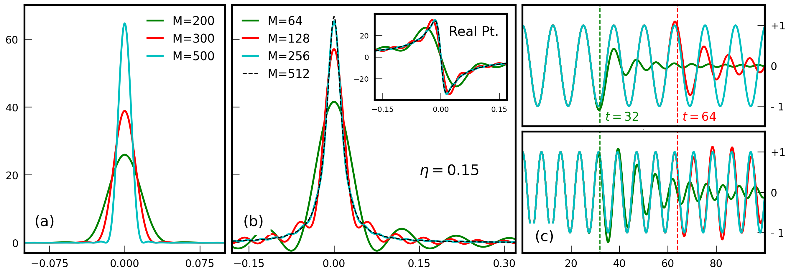

!!! Info
    
        Here, we briefly introduce the **main concepts** that underlie all spectral methods currently implemented in KITE. Focus is placed on the role of the simulation parameters that can be adjusted by the end-user in order to suit its specific purposes.

: The central object to any calculation done in KITE is the lattice single-particle Hamiltonian (SPH) — $H$ — which is always a sparse $D\!\times\!D$ hermitian matrix ($D$ being the total number of orbitals in the lattice). This fully embodies the simulated system, from its underlying bravais lattice structure and local orbital basis, to all the non-periodic terms that realize disordered potentials, specific boundary conditions, complex structural defects and external magnetic fields.

: Any finite-dimensional SPH has a bounded real-valued spectrum which must be shifted and rescaled to suitably fit within $[-1,1]$, the convergence interval of the method. This conversion is performed internally by KITE, which transforms $H\to\mathcal{H}=(H\!-\!\varepsilon_{0})/\delta\varepsilon$ and rescales all energy variables by $\delta\varepsilon$. This step requires an early (over)estimation of $H$'s spectral bandwidth, which can be set manually [as `#!python spectrum_range` =[$\,\varepsilon_{0}\!-\!\delta\varepsilon/2$,$\,\varepsilon_{0}\!+\!\delta\varepsilon/2$] in `#!python kite.Configuration()`] or, else, it is done automatically upon generation of the hdf5 configuration file. At this stage, the user must also specify:

: 1. The dimensions of the simulated lattice, `#!python lenght=[lx,ly,(lz)]`;
2. The number of subdivisions for parallelization of the matrix-vector operation, `#!python divisions=[nx,ny,(nz)]`, where $n_{x}n_{y}n_{z}$ is the available CPU-cores);
3. The type of boundary conditions;
4. The type of data to be handled in internal arithmetic operations (for further information see [Settings](settings.md)).

: Generally, a target function $\mathcal{Q}$ evaluated by [`#!python KITEx`](../api/kitex.md) fits one of the following forms:

$$
    \mathcal{Q}\left(\left\{ \lambda_{i}^{j}\right\} \right)=\begin{cases}
\text{Tr}\left[F_{1}\left(\left\{ \lambda_{i}^{1}\right\} _{i};\mathcal{H}\right)\mathcal{O}_{1}F_{2}\left(\left\{ \lambda_{i}^{2}\right\} _{i};\mathcal{H}\right)\mathcal{O}_{2}\cdots\mathcal{O}_{N}F_{N}\left(\left\{ \lambda_{i}^{N}\right\} _{i};\mathcal{H}\right)\right]\\
\left\langle \Psi\right|F_{1}\left(\left\{ \lambda_{i}^{1}\right\} _{i};\mathcal{H}\right)\mathcal{O}_{1}F_{2}\left(\left\{ \lambda_{i}^{2}\right\} _{i};\mathcal{H}\right)\mathcal{O}_{2}\cdots\mathcal{O}_{N}F_{N}\left(\left\{ \lambda_{i}^{N}\right\} _{i};\mathcal{H}\right)\left|\Psi\right\rangle 
\end{cases}\,\,\, ,
$$

: where $\mathcal{O}_{j}$ are sparse lattice operators (identities, velocity operators or spin operators) and $F_{j}$ are functions of $\mathcal{H}$, as well as other scalar parameters $\left\{ \lambda_{i}^{j}\right\} _{i}$, such as the energy or a frequency. Also in the previous equation $\left|\Psi\right\rangle$ is a specific state vector of the system that depends on the observable that is being computed. Thereby, there are two district categories of observables that can be computed with  [`#!python KITEx`](../api/kitex.md), namely

: - **Traces Over The Entire Hilbert Space.** — Which includes global observables such as the density of states (DoS), the dc-conductivity, the $1^{\text{st}}$- and $2^{\text{nd}}$- order optical conductivity (see João *et al.*[^1] for further details). For all these cases, the trace is evaluated stochastically as an average of expectation values for $R$ normalized random vectors[^2], i.e.,

$$
	\text{Tr}\left[\cdots\right]\approx\frac{1}{R}\sum_{r=1}^{R}\left\langle\xi_{r}\right|\cdots\left|\xi_{r}\right\rangle .
$$
	
: Within the user interface, the number of independent random vectors is specified by the parameter `#!python num_random`, which must be high enough to ensure a well-estimated trace. The associated error scales as $1/\sqrt{R\,D}$, and thus requires very few random vectors if the simulated system is very large[^2]. On top of this averaging, if $\mathcal{H}$ has a random component (by hosting disorder or featuring randomly twisted boundaries), it is often the case that the results are to be averaged over an ensemble of random hamiltonians. Such averaging is also done inside  [`#!python KITEx`](../api/kitex.md) and the number of random configurations is specified by user with the parameter `#!python num_disorder`.
: - **Diagonal Matrix Elements.** — This class of target functions includes local observables such as the local density of states (LDoS) and the $\mathbf{k}$-space spectral function (for ARPES's response), as well as the time-evolution of gaussian wave-packets. Note that `#!python num_random` is no longer a relevant parameter for these target functions.

: In both classes, the core of the method is to expand the functions $F_{j}$ as a truncated Chebyshev series of $\mathcal{H}$, which allows one to write 

$$
\mathcal{Q}\left(\left\{ \lambda_{i}^{j}\right\} \right)\!=\!\begin{cases}
\sum_{n_{1}=1}^{M}\!\cdots\!\sum_{n_{N}=1}^{M}G_{1}\!\left(\left\{ \lambda_{i}^{1}\right\} _{i};M\right)\cdots G_{N}\!\left(\left\{ \lambda_{i}^{N}\right\} _{i};M\right)\,\,\text{Tr}\left[T_{n_{1}}\!\left(\mathcal{H}\right)\mathcal{O}_{1}\cdots\mathcal{O}_{N}T_{n_{N}}\!\left(\mathcal{H}\right)\right]\\
\sum_{n_{1}=1}^{M}\!\cdots\!\sum_{n_{N}=1}^{M}G_{1}\!\left(\left\{ \lambda_{i}^{1}\right\} _{i};M\right)\cdots G_{N}\!\left(\left\{ \lambda_{i}^{N}\right\} _{i};M\right)\left\langle\Psi\right|T_{n_{1}}\!\left(\mathcal{H}\right)\mathcal{O}_{1}\cdots\mathcal{O}_{N}T_{n_{N}}\!\left(\mathcal{H}\right)\left|\Psi\right\rangle
\end{cases}\,\,,
$$

: where $T_{n}(x)$ are Chebyshev polynomials of the $1^{\text{st}}$- kind and $G_{j}$ are the expansion coefficients of $F_{j}$. The advantage of the previous expressions is that both $\text{Tr}\left[\cdots\right]$ and $\left\langle\Psi\right|\cdots \left|\Psi\right\rangle$ can be evaluated recursively using only matrix-vector operations [^1]. In all the observables implemented in KITE, the functions $F_{j}$ are of three types: 

: 1. Single-Parameter Dirac-$\delta$ Functions. — $F_{j}(\lambda_{1}^{i};\mathcal{H})\to\delta\left(\lambda-\mathcal{H}\right)$
2. Broadened Single-Particle Green's Functions. — $F_{j}(\lambda_{1}^{i},\lambda_{2}^{i};\mathcal{H})\to\left[\lambda+i\eta-\mathcal{H}\right]^{-1}$
3. Quantum Time-Evolution Operators. — $F_{j}\left(\lambda_{1}^{i},\mathcal{H}\right)\to\exp\left(\frac{i\,t\,\mathcal{H}}{\hbar}\right)$

: For these functions, analytical forms of the Chebyshev expansion coefficients are known [^2][^3][^4][^5][^6][^7] and used in KITE. In the user interface, the truncation order $M$ is specified by the parameter `#!python num_moments`, and always impacts the validity of the expanded results. Nevertheless, its precise effect depends crucially on the specific case, as shown in the Figure below. In particular, one has the following cases:

: - **Dirac-$\delta$ Function.** — An order-$M$ expansion (regularized by the Jackson kernel) produces a gaussian approximation of $\delta(\lambda\!-\!\mathcal{H})$ endowed by a width $\sigma_{\lambda}\!\approx\!\delta \varepsilon\,\pi/M$ in $\lambda$[^2][^7]. The choice of $M$ then fixes the effective spectral broadening, $\sigma_{\lambda}$, which must be sufficiently narrow to accurately describe all relevant features of the calculated curve. However, if it becomes too narrow ($M$ too high), the discrete eigenvalues of the SPH are well-resolved and the obtained data start suffering from large (finite-size) fluctuations. For information on other available kernels see Weisse *et al.*[^2].

    !!! Info "Rule of Thumb"

        If $\Delta\varepsilon$ is the mean-level spacing of the simulated system (that depends on the system size), then $M$ must be kept **smaller than** $\frac{\pi\,\delta\varepsilon}{\Delta\varepsilon}$ in order to avoid resolving individual energy levels. Simultaneously, for obtaining high-resolution results, the arificial broadening much remain much smaller than the total bandwidth, *i.e.*, $M\gg \pi\,\delta\varepsilon$.

: - **Single-Particle Green's Functions.** — Usually, no kernel is required here [^3][^4], as singularities of the Green's function are naturally broadened by a finite $\eta$. Provided $\eta$ exceeds the spacing between eigenvalues of the SPH, the truncation order may be arbitrarily increased and convergence is achieved when the data ceases to depend on M. Smaller values of $\eta$ typically require higher values of $M$ to converge.

    !!! Info "Rule of Thumb"

        Since the energy resolution is fixed by $\eta$, the number of polynomials must be larger enough to resolve such a broadening. As shown below, in Figure (b), an apt rule of thumb is to have $M\gtrsim 100/\eta$.

: - **Quantum Time-Evolution Operators.** — The truncation error introduced here translates into a limitation of the available time-interval of accurate unitary time-evolution. In the panels of Figure (c) it is demonstrated that the time-evolution operator is converged as long as $t\!\lesssim\!\hbar\,M/\delta\varepsilon$.

    !!! Info "Rule of Thumb"

        A safe empirical rule of thumb (used in Santos Pires *et al.*[^6]) is to have $M\!\gtrsim\!8\,\delta\varepsilon\,\hbar^{-1}t_{\text{max}}\!\!$, where $t\!<\!t_{\text{max}}$ is the length of the time-interval intended for the evolution.

: For some target functions, the output of KITE will be a function of energy (*e.g.*, the DoS) with maybe additional spacial coordinates (as it happens with the LDoS or the ARPES response). In contrast, most response functions are not properties of the Fermi level (the zero-temperature longitudinal conductivity is the only exception here) and therefore require that the raw output of KITE is numerically integrated in energy (tipically weighted by the Fermi-Dirac distribution at a given finite temperature). This step is always done at the post-processing level, by [`#!python KITE-tools`](../api/kite-tools.md).

	!!! Warning "Post-Processing Integration"
	
		For target functions that require energy integrations, a key parameter is the **number of energy points** for which the integrand is evaluated. In order to adjust it at the post-processing level, the user can use the `#!python -E` flag of the [`#!python KITE-tools`](../api/kite-tools.md) executable.

    

      <figure>
        
        <figcaption>Convergence of the Chebyshev series for (a) a Dirac-$\delta$ function, (b) a single-particle Green's function (real part as inset), and (c)  the time-evolution operator at two different energies (top: 0.5 and bottom: 0.8).</figcaption>
      </figure>
    

[^1]: **KITE:** high-performance accurate modelling of electronic structure and response functions of large molecules, disordered crystals and heterostructures, S. M. João, M. Anđelković, L. Covaci, T. G. Rappoport, João M. Viana Parente Lopes, and A. Ferreira, [R. Soc. open sci. 7, 191809 (2020)](https://royalsocietypublishing.org/doi/10.1098/rsos.191809).

[^2]: Kernel polynomial method, Alexander Weiße, Gerhard Wellein, Andreas Alvermann, and Holger Fehske. [Rev. Mod. Phys. 78, 275 (2006)](https://journals.aps.org/rmp/abstract/10.1103/RevModPhys.78.275).

[^3]: Critical delocalization of chiral zero energy modes in graphene, A. Ferreira and E. Mucciolo, [Phys. Rev. Lett. 115, 106601 (2015)](https://journals.aps.org/prl/abstract/10.1103/PhysRevLett.115.106601).

[^4]: Numerical evaluation of Green's functions based on the Chebyshev expansion, A. Braun and P. Schmitteckert, [Phys. Rev. B 90, 165112 (2014)](https://journals.aps.org/prb/abstract/10.1103/PhysRevB.90.165112).

[^5]: An accurate and efficient scheme for propagating the time dependent Schrödinger equation, H. Tal-Ezer and R. Kosloff, [J. Chem. Phys. 81, 3967-3971 (1984)](https://aip.scitation.org/doi/10.1063/1.448136).

[^6]: Landauer transport as a quasisteady state on finite chains under unitary quantum dynamics, J. P. Santos Pires, B. Amorim, and J. M. Viana Parente Lopes, [Phys. Rev. B 101, 104203 (2020)](https://journals.aps.org/prb/abstract/10.1103/PhysRevB.101.104203).

[^7]: Spectral functions of one-dimensional systems with correlated disorder, N. A. Khan, J. M. Viana Parente Lopes, J. P. Santos Pires, J. M. B. Lopes dos Santos, [J. Phys.: Condens. Matt. 31, 175501 (2019)](https://iopscience.iop.org/article/10.1088/1361-648X/ab03ad/meta).
