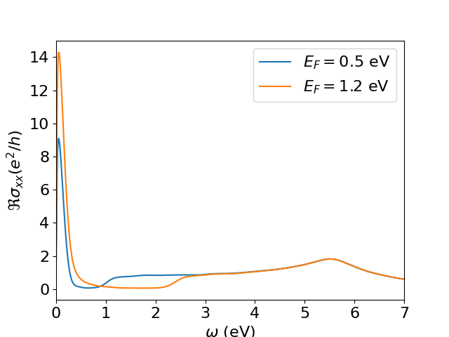

As presented previously, [KITEx][kitex] typically calculates the Chebyshev moments of a user-specified spectral calculation and stores them in the
same HDF file that was generated by the configuration script.
These moments are used by the post-processing tool named [KITE-tools][kitetools]  to reconstruct the desired physical quantities, such as the density of states or the optical conductivity.
Some special target functions are computed 'on the fly', such as the single-shot DC conductivity, and thus require no post processing. 

In a basic setup, the python configuration script specifies the post-processing parameters (e.g., number of energy points),
which are exported to the HDF file with other settings.
Here, the HDF file containing the Chebyshev moments computed by [KITEx][kitex] works as an input to
[KITE-tools][kitetools], which retrieves the post-processing parameters and the Chebyshev moments from the HDF file and uses these to calculate the desired
quantities and export them to data files.
If a parameter is not specified, a default value is used.

However, many of these quantities depend on a set of physical parameters (such as temperature, chemical potential, etc.) that are not necessary
for the calculation of Chebyshev moments.
Therefore, the user can modify them to quickly recalculate quantities with [KITE-tools][kitetools], without the need of running [KITEx][kitex] again.
For example, if the user wants to obtain the optical conductivity as a function of the frequency for several values of chemical potential/temperature,
the Chebyshev moments (computed once by [KITEx][kitex]) can be used by [KITE-tools][kitetools] to quickly obtain the optical conductivity curves for the different parameter choices.

## Using the post-processing

For this purpose, the user has the flexibility to override the parameters from the python script by specifying them
in the command line interface. As an example, let us consider the example  `#!python dos_optcond_gaussian_disorder.py`: If we consider the setting

``` bash
./build/KITE-tools optcond_gaussian_disorder-output.h5 --CondOpt -F 1.2 -O 0 10 1000 -N optcond1.2.dat
```

KITE-tools will calculate the optical conductivity with a Fermi energy specified by the option `#!bash -F 1.2`
(in units specified in the configuration file). The option `#!bash -O` sets the frequency interval between `#!bash 0`and `#!bash 10`
(in the same units) and the total number of frequency points (`#!bash 1000`). These options will be used to recalculate
the optical conductivity even if the original configuration file presents different values. 
The option `#!bash -N` defines the name of the output file.

We can modify the Fermi energy and produce a different optical conductivities without recalculating the Chebyshev moments:  

``` bash
./build/KITE-tools optcond_gaussian_disorder-output.h5 --CondOpt -F 0.5 -O 0 10 1000 -N optcond0.5.dat
```
We can now compare the real component of two different optical conductivities  
<div>
     <figure>
        
        <figcaption>Comparison between the real components of the optical conductivity of disordered graphene for two Fermi energies.</figcaption>
      </figure>
</div>


The same type of strategy can be used to calculate the optical conductivity for different temperatures.


!!! Info

    For a more detailed list of possible commands/options for [KITE-tools][kitetools], we strongly recommend you look at the [API].

## Other cases: bespoke post processing

Some functionalities do not require postprocessing or use bespoke postprocessing tools that are not included in [KITE-tools][kitetools]. 
For example, the single-shot longitudinal conductivity functionality `#!python singleshot_conductivity_dc` _does not_ store Chebyshev moments in the *.h5 file, rather it requests [KITEx][kitex] to directly calculate the dc-conductivity for specified values of the Fermi energy. 
To extract the calculated DC conductivity from the *.h5 file, we can use a python script located in the `#!python tools` directory:  `#!python process_single_shot.py`. 
In the same `#!python tools` directory, users can find another bespoke script which plots the output of a spectral function (ARPES) calculation.


[kitex]: ../api/kitex.md
[kitetools]: ../api/kite-tools.md
[API]: ../api/kite-tools.md#advanced-usage
