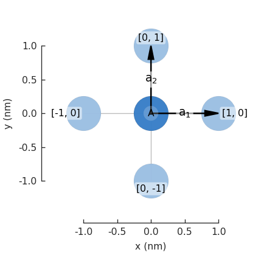
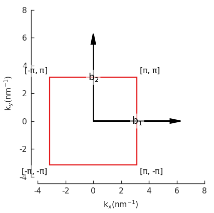
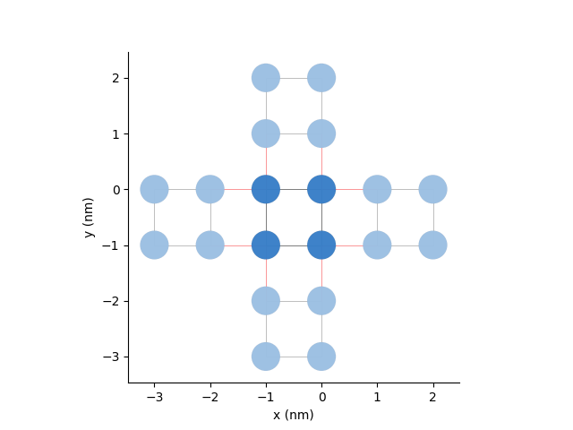
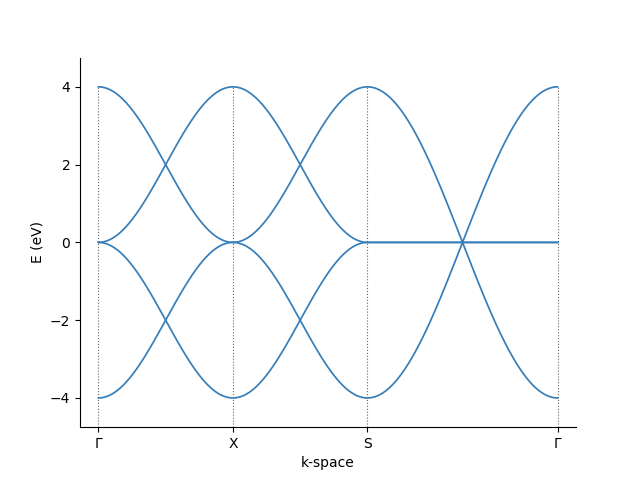
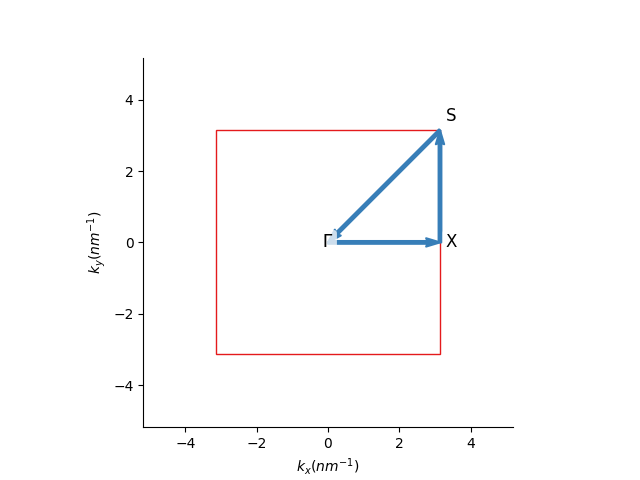

The aim of the current section is to help us gain familiarity with the lattice model of KITE. 
Thus, we will being by constructing a periodic [`#!python pb.Lattice`][lattice] using [Pybinding]
and calculate its band structure using [`#!python pb.Solver`][lattice] (also from [Pybinding]). 
In the following sections, we will then see how to use [KITEx][kitex] to both being able to significantly scale up the simulations and make interesting modifications to the lattice model. 

For efficiency, the default options of KITE's core code ([KITEx][kitex]) assume that the lattice model has a certain degree of interconnectivity or hopping range. 
Specifically, the default is that the tight-binding Hamiltonian has non-zero matrix elements between orbitals that belong to unit cells 
that are separated by at most 2 lattice spacings along a given direction (for example, in a simple single-orbital 1D chain this would allow defining models
with up to second-nearest neighbors). To relax this constraint and thus be able to simulate more complex lattice models, users must adjust the NGHOSTS parameter in `#!bash kite/Src/Generic.hpp` and recompile [KITEx][kitex], otherwise an error message is output and the KITE program exits.

!!! Info

    If you are familiar with [Pybinding], you can go directly to the next tutorial page.

!!! Note

    The python script that generates KITE's input file requires a few packages that can be included with the following aliases
    
    ``` python
    import kite
    import pybinding as pb
    import numpy as np
    import matplotlib.pyplot as plt
    ```

## Making a `#!python pb.Lattice`
The [`#!python pb.Lattice`][lattice] class from [Pybinding] carries the information about the [TB model][tightbinding].
This includes

* [Crystal structure (*lattice unit cell* and *basis*)][unitcell]
* [Onsite energies][onsite]
* [Hopping parameters][hopping]

[Pybinding] also provides additional functionalities based on this *real-space* information. It can provide, for example, the *reciprocal vectors* and the *Brillouin zone*.

### Defining the unit cell
As a simple example, let us construct a square lattice with a single orbital per unit cell.
The following syntax can be used to define the primitive lattice vectors:

``` python linenums="1"
a1 = np.array([1, 0]) # [nm] defines the first lattice vector
a2 = np.array([0, 1]) # [nm] defines the second lattice vector

lat = pb.Lattice(a1=a1, a2=a2) # defines a lattice object
```

### Adding lattice sites
We than add the desired lattice sites/orbitals inside the unit cell (the same syntax can be used to add different orbitals in a given position or more sites in different sublattices):

``` python linenums="1"
onsite = 0 # onsite potential
lat.add_sublattices(
    # generates a lattice site (sublattice) with a tuple
    # (name, position, and onsite potential)
    ('A', [0, 0], onsite)
)
```

### Adding hoppings
By default, the main unit cell has the index `#!python [n1,n2] = [0, 0]`.
The hoppings between neighboring sites can be added with the simple syntax:

``` python linenums="1"
lat.add_hoppings(
    # generated a hopping between lattice sites with a tuple
    # (relative unit cell index, site from, site to, hopping energy)
    ([1, 0], 'A', 'A', - 1 ),
    ([0, 1], 'A', 'A', - 1 )
)
```

Here, the relative indices `#!python n1,n2` represent the number of integer steps - in units of the primitive lattice vectors - needed to reach a neighboring cell starting from the origin.

If the lattice has more than one sublattice, the hoppings can connect sites in the same unit cell.

!!! note

    When adding the hopping `#!python (n, m)` between sites `#!python n` and `#!python m`,
    the conjugate hopping term `#!python (m, n)` is added automatically. Pybinding does not allow the user to add them by hand.

### Visualization
Now we can plot the [`#!python pb.lattice`][lattice] and visualize the Brillouin zone:

``` python linenums="1"
lat.plot()
plt.show()

lat.plot_brillouin_zone()
plt.show()
```

<div>
  <figure>
    
    
    <figcaption>The visualization of the lattice and its Brillouin zone.</figcaption>
  </figure>
</div>

!!! Example "Examples"

    For a crystal with two atoms per unit cell, look in the [Examples] section.
    For other examples and pre-defined lattices consult the [Pybinding] documentation.


## Using Pybinding's solver
[Pybinding] has build-in solvers for

* [LAPACK] *(exact diagonalization)* and
* [ARPACK] (targeted diagonalization of sparse matrices).
To use any of these solvers, we need to first construct a model.

### Building a `#!python pb.Model`
The [`#!python pb.Model`][model] class contains all the information of the structure we want to use in our calculation.
This structure can be significantly larger than the unit cell (*stored in the [`#!python pb.Lattice`][lattice]-class). It can also have specific geometries and other possible modifications of the original lattice. 
Here, we will just double the unit cell in both directions in the [`#!python pb.Model`][model] and add periodic boundary conditions:
``` python linenums="1"
model = pb.Model(
    lat,  # pb.Lattice, uses the previously defined unit-cell
    pb.primitive(2, 2),  # doubles the unit-cell in both directions
    pb.translational_symmetry(a1=2, a2=2)  # periodic boundary conditions with period '2'
)
```
We can visualise this [`#!python pb.Model`][model] with
``` python linenums="1"
model.plot()
plt.show()
```
<div>
  <figure>
    
    <figcaption>The visualization of the model.</figcaption>
  </figure>
</div>

### Defining a `#!python pb.Solver`
The [`#!python pb.Solver`][solver] class takes a [`#!python pb.Model`][model] class as input and prepares the system to perform a numerical calculation. We will use the [LAPACK] solver:
``` python linenums="1"
solver = pb.solver.lapack(
    model  # pb.Model, use the previously defined system
)
```

### Band structure calculation
As an example, the band structure is calculated using the [`#!python pb.Solver`][solver] defined above.

First, for a two-dimensional plot, we define a path in the reciprocal space that connects the high symmetry points. Using the [`#!python pb.Lattice`][solver] build-in
method, the high symmetry points for the corners of a path can be found easily:
``` python linenums="1"
bz = lat.brillouin_zone()
gamma = np.array([0, 0]) 
x = (bz[1] + bz[2]) / 2
s = bz[2]
```

 Then, we just pass these corners to the [`#!python pb.Solver`][solver] and visualize the result
``` python linenums="1"
bands = solver.calc_bands(gamma, x, s, gamma, step=0.01)
bands.plot(point_labels=[r"$\Gamma$", "X", "S", r"$\Gamma$"])
plt.show()

lat.plot_brillouin_zone(decorate=False)
bands.k_path.plot(point_labels=[r"$\Gamma$", "X", "S", r"$\Gamma$"])
plt.show()
```
<div>
  <figure>
    
    
    <figcaption>The visualization of the band structure and its path in the reciprocal space.</figcaption>
  </figure>
</div>

For more info about [Pybinding]'s capabilities, look at its [tutorial][tutorial-pb] or [API guide][api-pb].

!!! Example "Summary of the code from this section"

    ``` python linenums="1"
    import kite
    import pybinding as pb
    import numpy as np
    import matplotlib.pyplot as plt
    
    a1 = np.array([1, 0]) # [nm] define the first lattice vector
    a2 = np.array([0, 1]) # [nm] define the second lattice vector
    
    lat = pb.Lattice(a1=a1, a2=a2) # define a lattice object
    
    
    onsite = 0 # onsite potential
    lat.add_sublattices(
        # make a lattice site (sublattice) with a tuple
        # (name, position, and onsite potential)
        ('A', [0, 0], onsite)
    )

    lat.add_hoppings(
        # make an hopping between lattice site with a tuple
        # (relative unit cell index, site from, site to, hopping energy)
    ([1, 0], 'A', 'A', - 1 ),
    ([0, 1], 'A', 'A', - 1 )
    )
    
    model = pb.Model(
        lat,  # pb.Lattice, use the previously defined unit-cell
        pb.primitive(2, 2),  # double the unit-cell in both directions
        pb.translational_symmetry(a1=2, a2=2)  # periodic boundary conditions with period '2'
    )
    
    solver = pb.solver.lapack(
        model  # pb.Model, use the previously defined system
    )
    
    bz = lat.brillouin_zone()
    gamma = np.array([0, 0]) 
    x = (bz[1] + bz[2]) / 2
    s = bz[2]
    
    bands = solver.calc_bands(gamma, x, s, gamma, step=0.01)
    bands.plot(point_labels=[r"$\Gamma$", "X", "S", r"$\Gamma$"])
    plt.show()

    lat.plot_brillouin_zone(decorate=False)
    bands.k_path.plot(point_labels=[r"$\Gamma$", "X", "S", r"$\Gamma$"])
    plt.show()
    ```

[unitcell]: #defining-the-unit-cell
[onsite]: #adding-lattice-sites
[hopping]: #adding-hoppings
[hdf5]: https://www.hdfgroup.org
[Pybinding]: https://docs.pybinding.site/en/stable
[lattice]: https://docs.pybinding.site/en/stable/_api/pybinding.Lattice.html
[model]: https://docs.pybinding.site/en/stable/_api/pybinding.Model.html
[solver]: https://docs.pybinding.site/en/stable/_api/pybinding.solver.html#module-pybinding.solver
[ARPACK]: https://docs.pybinding.site/en/stable/_api/pybinding.solver.html#pybinding.solver.arpack
[LAPACK]: https://docs.pybinding.site/en/stable/_api/pybinding.solver.html#pybinding.solver.lapack
[tutorial-pb]: https://docs.pybinding.site/en/stable/tutorial/index.html
[api-pb]: https://docs.pybinding.site/en/stable/api.html

[tightbinding]: ../background/tight_binding.md
[Examples]: examples/graphene.md

[kitepython]: ../api/kite.md
[kitex]: ../api/kitex.md