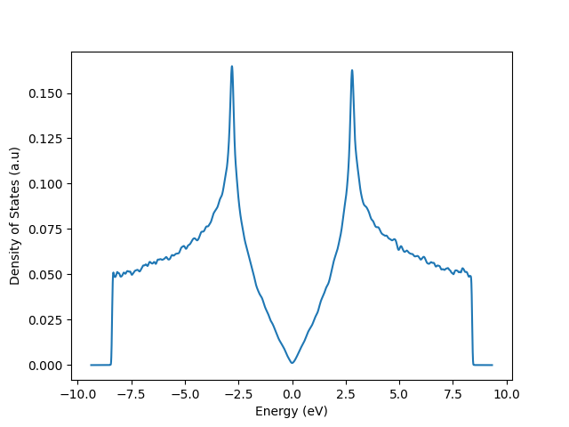

*(This example details the calculation from the [Tutorial/Getting Started][tutorial]*)
## The TB-model for Graphene

The electronic structure of graphene is well described by a simple tight-binding model that only uses one $p_z$ orbital
in a hexagonal unit cell with two equivalent carbon atoms.
These atoms are located on the different subbattices, *A* and *B*, and don't have an on-site energy term.

Though the model is relative simple, it is used suite often in the literature.

### Lattice
The code below illustrates the building of the [`#!python pb.lattice`][lattice] for graphene:

* define the parameter ($t$ in $eV$)
* define the vectors of the unit-cell ($\vec a_1$ and $\vec a_2$ in units of $a$, length of the unit-cell)
* create a [`#!python pb.lattice`][lattice]-object
* define the on-site energies
* define the hopping parameters
    * 1 *normal* hopping within the unit cell
    * 2 *rotated* hopping $\pm 2 \pi/3$ to neighbouring cells
* return the [`#!python pb.lattice`][lattice]-object to be used by KITE

``` python linenums="1"
def graphene_lattice(onsite=(0, 0)):
    """Return lattice specification for a honeycomb lattice with nearest neighbor hoppings"""

    # parameters
    a = 0.24595  # [nm] unit cell length
    a_cc = 0.142  # [nm] carbon-carbon distance
    t = 2.8  # eV

    # define lattice vectors
    a1 = a * np.array([1, 0])
    a2 = a * np.array([1 / 2, 1 / 2 * np.sqrt(3)])

    # create a lattice with 2 primitive vectors
    lat = pb.Lattice(a1=a1, a2=a2)

    # add sublattices
    lat.add_sublattices(
        # name, position, and onsite potential
        ('A', [0, -a_cc/2], onsite[0]),
        ('B', [0,  a_cc/2], onsite[1])
    )

    # Add hoppings
    lat.add_hoppings(
        # inside the main cell, between which atoms, and the value
        ([0, 0], 'A', 'B', -t),
        # between neighboring cells, between which atoms, and the value
        ([1, -1], 'A', 'B', -t),
        ([0, -1], 'A', 'B', -t)
    )
    return lat
```

We can visualize this lattice using the following code:

``` python linenums="1"
lat = graphene_lattice()
lat.plot()
plt.show()
```

<div>
  <figure>
    
    <figcaption>A visualization for the defined lattice for graphene.</figcaption>
  </figure>
</div>

## KITE part
### Settings
We can make the [`#!python kite.Calculation`][calculation]-object
``` python linenums="1"
configuration = kite.Configuration(
  divisions=[64, 64],
  length=[512, 512],
  boundaries=["periodic", "periodic"],
  is_complex=False,
  precision=1
)
calculation = kite.Calculation(configuration)
calculation.dos(
  num_points=4000,
  num_moments=256,
  num_random=256,
  num_disorder=1
)
```

### Calculation
Now, run the [KITEx][kitex] program and the [KITE-tools][kitetools].

### Visualization

``` python linenums="1"
import numpy as np
import matplotlib.pyplot as plt

data = np.loadtxt('dos.dat')
plt.plot(data[:,0], data[:,1])
plt.show()
```

<div>
  <figure>
    
    <figcaption>The DOS for graphene.</figcaption>
  </figure>
</div>

[tutorial]: ../index.md
[calculation]: ../../api/kite.md#calculation
[getting_started]: ../index.md
[lattice]: https://docs.pybinding.site/en/stable/_api/pybinding.Lattice.html
[kitex]: ../../api/kitex.md
[kitetools]: ../../api/kite-tools.md