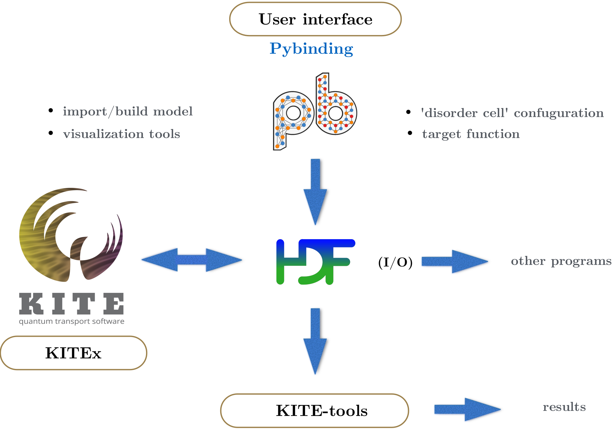

KITE has 3 different layers:

* [User interface (*Python*)][kitepython]
* [Main program (*C++*)][kitex]
* [Post-processing tool (*C++*)][kitetools]
 
The [tight-binding][tightbinding] (TB) model is first built with the [user interface][kitepython]
KITE's user interface is based on [Pybinding]. However,
it has additional features for complex disorder, fields modifications
and target functions *e.g*., DOS, conductivity, ...
The model is exported to a [HDF5]-file, together with the settings for the calculation.
This file is then given as an input to the main program (*[KITEx][kitex]*).
The *input* and *output* for the main program are written to the same [HDF5] file.

The workflow is as follows:

1. Build a [`#!python pb.Lattice`][lattice] that describes a tight-binding model (*using [Pybinding]*)
2. Specify any adaptation (such as disorder of magnetic field) to this [`#!python pb.Lattice`][lattice] (*using [KITE's python interface][kitepython]*)
3. Specify the settings (*using [KITE's python interface][kitepython]*)
4. Specify the quantities to calculate (*using [KITE's python interface][kitepython]*)
5. Export a [HDF5]-file (*using [KITE's python interface][kitepython]*)
6. Perform the calculations with the [HDF5]-file (*using [KITEx][kitex]*)
7. Run the post-processing tools (*using [KITE-tools][kitetools]*)
8. Visualise the data

!!! Tip

**It is possible to use a [simple python script][script] for the whole workflow.** 

  <figure>
    
    <figcaption>The different components of KITE and its workflow.</figcaption>
  </figure>

[HDF5]: https://www.hdfgroup.org
[Pybinding]: https://docs.pybinding.site/en/stable
[lattice]: https://docs.pybinding.site/en/stable/_api/pybinding.Lattice.html
[script]: index.md
[tightbinding]: ../documentation/tight_binding.md

[kitepython]: ../api/kite.md
[kitex]: ../api/kitex.md
[kitetools]: ../api/kite-tools.md