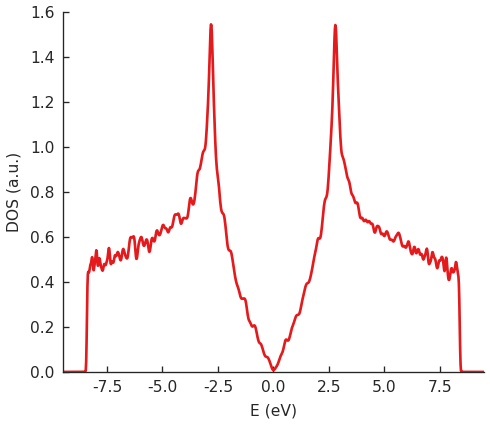

Quantum Kite is a multi threaded C++ package developed for efficient evaluation of spectral properties of Large-Scale Tight-Binding (TB) Hamiltonians. Under the assumptions of the basic knowledge of TB approximation, inside this tutorial we will present the code functionalities through different examples in form of inline code and gists which you can simply copy or download from our Github page _add_link_ and run. For more information on the TB method we suggest you to take a look at the section Resources _add_link_. If you encountered a peculiar problem, found a bug, or have any further question, we encourage you to contact us _add_link_, and we will try to respond as soon as possible.

# Code workflow

At present, code is divided into three different layer. Starting point is making a TB model using the Pybinding package. In the next section we will show a couple of simple examples, and introduce basic functionalities of Pybinding package, which will be used for making the model. More advanced examples you can check in the section _add_link_.

Quantum Kite is shipped as a source code which can be compiled following the instruction provided in the section Installation _add_link_. The code consists of the transport, and the post-processing code.
The interconnections between different part of the code is done using the Hierarchical Data Format (HDF5 package). The model is made and exported as a *.h5 file, which is used later as a TB input to Quantum Kite, and posprocessing tools (changing the name??). All the output data is saved in the same file.

As a last step, after obtaining the desired quantity, we can visualize the resulting data using a simple script:
https://gist.github.com/MAndelkovic/a5b5f47509430458d193ba169f212177.

In short, the code workflow is the following:

* Making and exporting a TB model from Pybinding.
* Running Quantum Kite with an input TB model.
* Running PostProcessingTools.
* Visualizing the data.

If you want to make this more automatic, you can use the following Bash
script https://gist.github.com/MAndelkovic/37c87d573b62c9504a44ac92771142c3.

# Making and exporting a TB model from Pybinding

Before going to examples, let's see how to load Pybinding.

## Importing the package

If all the requirements are fulfilled, Pybinding package can be imported in the python script. In all the scripts in this tutorial, required packages will be included with following aliases.

```python
import pybinding as pb
import numpy as np
import matplotlib.pyplot as plt
```

If you want to use predefined styles for visualization, you can simply
write:

 ```python
 pb.pltutils.use_style()
 ```

inside the script.

## Making the model

The most important object for making a TB model is pb.Lattice, which
carries the full information about the unit cell (position of lattice sites,
info on the type of sites (different atoms etc.), lattice vectors,
hopping parameters). These are all input parameters for the Lattice.
Additional features available based on the real-space information are
reciprocal vectors and the Brillouin zone.

Let's make a simple square lattice with a single lattice site.

First, import all the packages:

```python
import pybinding as pb
import numpy as np
import matplotlib.pyplot as plt
```

Defining the lattice vectors and making the lattice has following syntax:

```python
a1 = np.array([1,0]) # [nm] define the first lattice vector
a2 = np.array([0, 1]) # [nm] define the second lattice vector

lat = pb.Lattice(a1=a1, a2=a2) # define a lattice object
```

Now we can add the desired lattice site:

```python
lat.add_sublattices(
    # make a lattice site (sublattice) with a tuple
    # (name, position, and onsite potential)
    ('A', [0, 0], onsite[0])
)
```

and adding hoppings between the neighboring sites:

```python
lat.add_hoppings(
    # make an hopping between lattice site with a tuple
    # (relative unit cell index, site from, site to, hopping energy)
    ([1, 0], 'A', 'A', - 1 / energy_scale),
    ([0, 1], 'A', 'A', - 1 / energy_scale)
)
```

Relative unit cell index ```[n, m]``` is a parameter of the unit cell
(in the notation ```n * a1 , m * a2```) to which the hopping occurs. The index
```[0, 0]``` is a reference hopping inside the unit cell, while other indexes mark
the periodic hopping.

It's important to emphasize that by adding the hopping between sites
```(i, j)``` the hopping therm ```(j, i)``` is added automatically, and it's not
allowed to add them twice. Also, it's not allowed to add hopping
```(i, i)``` inside the cell ```[0,0]``` because these terms are actually
onsite energies that can be added when adding a lattice site (sublattice).

Parameter ```energy_scale``` is the scaling term form the Hamiltonian which
ensures that the minimal and maximal eigenvalue are inside the range ```[-1, 1]```,
this is a requirement for expansion in terms of Chebyshev polynomials.
Underestimating the bounds will result in ```NaN``` values, and can be a common
reason for not getting any results.

Now we can plot the lattice:

```python
lat.plot()
plt.show()
```

or visualize the Brillouin zone:

```python
lat.plot_brillouin_zone()
plt.show()
```

Now let's try to make just a slightly advanced example, a graphene lattice:
https://gist.github.com/MAndelkovic/a5f085ce48b5d28de68b03b08008b57f

## Selecting a function and exporting the model

After making the Lattice object, we can output both the model and information about the quantities that we want to calculate. For this, we need an additional functionalities that can be imported:

```python
import export_lattice as ex
```
In this script three different classes are defined:
1. ```Configuration```
2. ```Calculation```
3. ```Modification```

These three will forward the information about the system being made. Objects of class ```Configuration``` carry the info about:

* ```divisions``` - integer number of system decomposition parts in each direction. Product of these values will be the number of threads that the code will use,
* ```length``` - integer number of unit cells along direction of chosen vectors,
* ```boundaries``` - boolean value defining periodic boundaries along directions,
* ```is_complex``` - boolean value which defines whether Hamiltonian is complex or not,
* ```precision``` - integer identifier of data type that the system will use, float 0, double 1, long double 2,
* ```energy_scale``` - float parameter that defines the scaling factor for all energy relater terms.
The scaling is done automatically in background and you shouldn't worry much about this, except being sure that scaled Hamiltonian ```H/energy_scale``` will have spectrum in the range [-1, 1].

An example of making a ```Configuration``` object can be following:
```python
configuration = ex.Configuration(divisions=[2, 2], length=[128, 128], boundaries=[True, True],
                                 is_complex=False, precision=0, energy_scale=10)
```
An important note on the requested size of the system, number of unit cells along a certain direction divided by the number of decomposition parts along the same direction need to be a multiple of ```stride``` number defined when compiling Quantum Kite (if you're not sure about which number we're talking about, you probably kept a default value which is 4, meaning that if you select 4  decomposition parts you will need to take at least 16 unit cells, or a multiple of it).

```Calculation``` object defines which quantity we want to calculate.
Here we list features/functions that are available at present:

* fname - name of the function that you want to evaluate, case insensitive:
  old interface:
  * ```DOS```
  * ```OptCondXX```, ```OptCondXY``` ()

  new interface:
  * ```dos``` - density of states, parameters: ```num_points```,
  * ```conductivity_optical``` - optical conductivity linear response, parameters: ```direction```, ```temperature```, ```num_points```
  * ```conductivity_dc``` - zero frequency conductivity linear response, parameters: ```direction```, ```temperature```, ```num_points```
  * ```conductivity_optical_nonlinear``` - zero frequency conductivity linear response, parameters: ```direction```, ```temperature```, ```num_points```
  * ```singleshot_conductivity_dc``` - single energy zero frequency longitudinal conductivity, parameters: ```direction``` (limited to longitudinal direction), ```energy```, ```gamma```.
* ```num_moments``` - number of polynomials used in the expansion,
* ```num_random``` - number of random vectors used in the trace evaluation,
* ```num_disorder``` - number of different disorder realisations,

Following parameters are optional and are available for a function that supports them, for one info check previous definitions of function names:
* ```direction``` - direction along which conductivity is calculated (longitudinal: 'xx', 'yy', 'zz', transversal: 'xy', 'xz', 'yx', 'yz', 'zx', 'zy')
* ```temperature``` - choose a temperature in Fermi Dirac distribution
* ```num_points``` - number of evaluation points,
* ```special``` - simplified form of nonlinear optical conductivity hBN example
* ```energy``` - selected value of energy at which we want to calculate the singleshot_conductivity_dc
* ```gamma``` - kernel parameter that mimics broadening [eV] (check this!!!)

In a single request, you can add multiple functions that you want to evaluate like:
```python
calculation = ex.Calculation(fname=['DOS', 'conductivity_dc', 'conductivity_optical_nonlinear',
                                    'singleshot_conductivity_dc'],
                             num_moments=[1024, 1, 1, 1], num_random=[1, 1, 1, 1], temperature=[100, 0],
                             num_disorder=[1, 1, 1, 1], direction=['xx', 'xy', 'zz'], energy=[0,0], gamma=[0.1], special=1)
```

The last object of a class ```Modification``` defines special modifiers of the system. At the moment, only ```magnetic_field``` is available as an optional boolean parameter, which if ```True``` adds minimal value of the magnetic field that will obey a commensurability condition between the magnetic and material unit cell (single flux quanta through the surface of unit cell).
It can be defined as:
```python
modification = ex.Modification(magnetic_field=False)
```
When these objects are defined, we can export the file that will contain set of input instructions for Quantum Kite:
```python
ex.export_lattice(lattice, configuration, calculation, modification, 'example_new_naming_convention.h5')
```
The following script merges all of the above mentioned in a singe place:

https://gist.github.com/MAndelkovic/633949a568f5c7842381be265b49c02a

# Visualizing the data

After calculating the quantity of interest and post processing the data,
we can plot the resulting data using Pybinding classes/functions with
the following script (change the name of input data):

https://gist.github.com/MAndelkovic/a5b5f47509430458d193ba169f212177


Image from a local repo.


Image from a GitHub repo.

TODO: There are different classes from PB that should be documented,
sweep plots, scatter etc. Can be very useful.


## TODO: Tutorial about the types of disorder and more on exporting the lattice...
